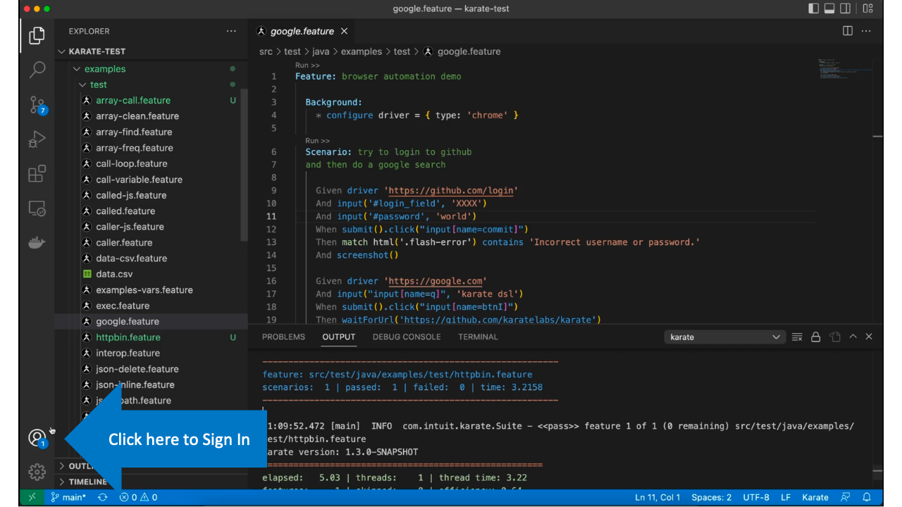
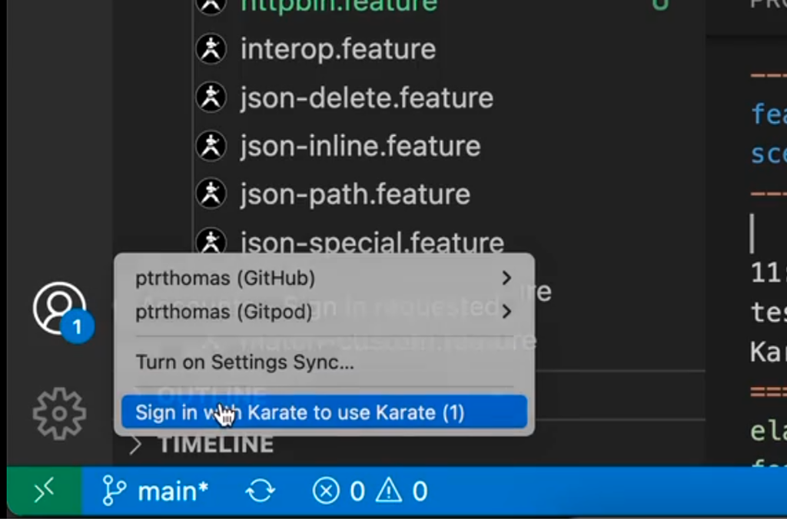
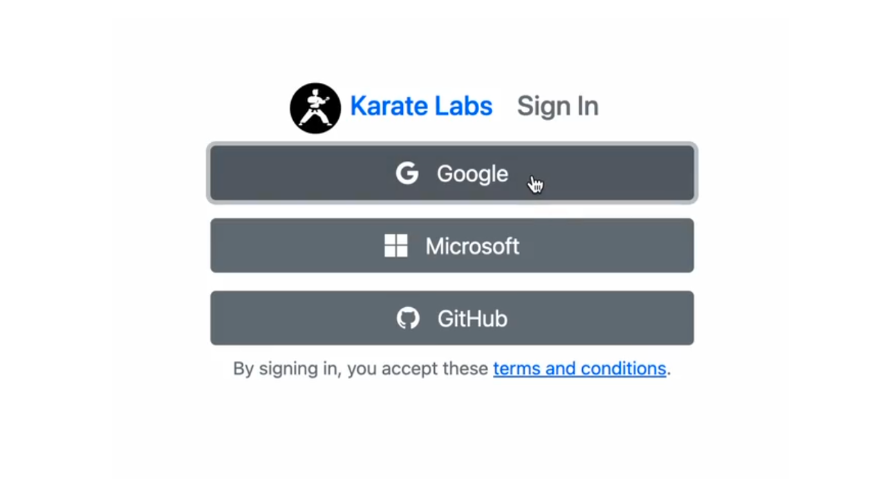
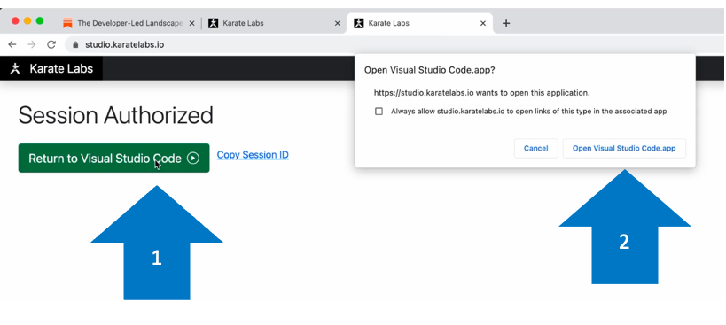
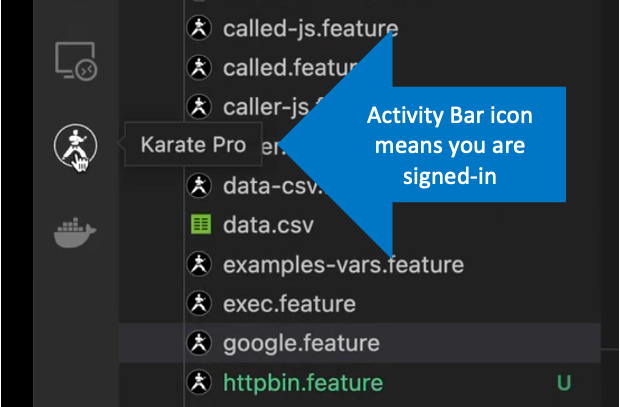

# Karate VS Code Extension

<table>
<tr>
<td>
<a href="https://marketplace.visualstudio.com/items?itemName=karatelabs.karate">VS Code Marketplace</a>
</td>
<td>
<a href="https://open-vsx.org/extension/karatelabs/karate">Open VSX Registry</a>
</td>
<td>
<a href="https://github.com/karatelabs/karate-vscode-extension/issues">Issue Tracker / Feature Requests</a>
</td>
</tr>
</table>

## How to Sign In and Upgrade

<table>
<tr>
<td>

</td>
<td>

</td>
<td>

</td>
</tr>
<tr>
<td>

</td>
<td>

</td>
</tr>
</table>
