<table>
    <tr>
        <td>
            <br/><a href="https://karatelabs.io"></a>
        </td>
        <td>
            <h2><br/>VS Code<br/>Extension</h2>           
        </td>
        <th>
            <h3><a href="https://youtu.be/IYSNjX5dPZA?si=E1rq8b37UtiwdEV9">:tv: <br/>&nbsp;Video&nbsp;</a></h3>
        </th>        
        <th>
            <h3><a href="https://www.karatelabs.io/pricing">:heavy_dollar_sign: <br/>Pricing</a></h3>
        </th>       
        <th>
            <h3><a href="https://marketplace.visualstudio.com/items?itemName=karatelabs.karate"><br/>:zap: <br/> Market<br/>place</a></h3>
        </th>
        <th>
            <h3><a href="https://open-vsx.org/extension/karatelabs/karate"><br/>:bulb: <br/>&nbsp;Open&nbsp;<br/>VSX</a></h3>
        </th>         
        <th>
            <h3><a href="https://github.com/karatelabs/vscode-extension/issues">:octocat: <br/>Issues</a></h3>
        </th>        
    </tr>
</table>

<table>
    <tr>
        <th>PLUS</th>
        <th>PRO</th>
        <th>Enterprise</th>
    </tr>    
    <tr>
        <td>            
            <ul>
                <li><a href="https://youtu.be/nXUSnxcdljQ?si=k-M5AYz9nGZylzD8&t=38">Syntax coloring</li>                
                <li>Run Feature from editor</li>
                <li><a href="#run-from-editor">Run single Scenario / Example</a></li>
                <li><a href="#launch-configurations">Launch Configurations</a></li>
                <li><a href="#outline-view">Outline view</a></li>
                <li><a href="https://youtu.be/nXUSnxcdljQ?si=pD7LjtF7hS43Q813&t=363">Code formatting</a></li>
                <li><a href="https://youtu.be/nXUSnxcdljQ?si=iyJMEdL19I5BkGxf&t=421">Test Results in IDE</a></li>
            </ul>
        </td>
        <td>
            <i>&nbsp;&nbsp;&nbsp;&nbsp;(includes all in PLUS)</i>
            <ul>
                <li><a href="#auto-complete">Auto complete</a></li>                
                <li><a href="#code-folding">Code folding</a></li>
                <li><a href="#references">Jump to references</a></li>
                <li><a href="#json-re-formatting">JSON re-formatting</a></li>
                <li><a href="#run-folder">Run all tests in folder</a></li>
                <li>Run Karate Labs add-ons (e.g. <a href="https://github.com/karatelabs/karate-addons/blob/main/karate-kafka/README.md">Kafka</a>)</li>
                <li><a href="#debug">Debug Karate test</a></li>
                <li>Debug Java &amp; Karate in same session</li>
                <li>Java debug session stops at Karate breakpoints</li>
                <li>cURL import *</li>
                <li>OpenAPI support *</li>
            </ul><i>&nbsp;&nbsp;&nbsp;&nbsp;[*] coming soon</i>
        </td>
        <td>
            <ul>
                <li>Priority support</li>
                <li>SSO / SAML support</li>
                <li><a href="#offline-license">Offline license</a></li>
                <li><a href="https://www.karatelabs.io/contact-us">Contact us</a></li>
            </ul>        
        </td>        
    </tr>
</table>

> By using this plugin, you agree to the Karate Labs [EULA](https://karatelabs.io/eula). Data on a few user actions is collected and subject to our [Privacy Policy](https://karatelabs.io/privacy-policy). HTML reports generated by the Karate open-source library has [additional analytics](https://github.com/karatelabs/karate/blob/master/karate-core/src/test/resources/analytics.md).

## License Activation
License activation and status is available via a command. Go to `View -> Command Palette`, type `Karate` and you should see something like this.

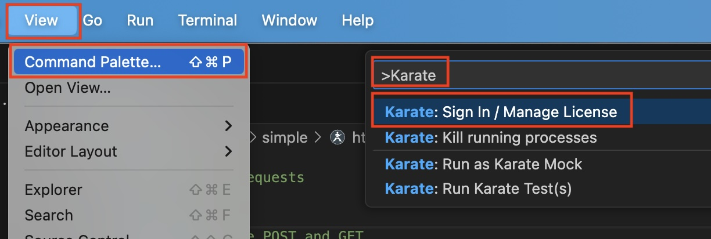

<p>&nbsp;</p>

Choose the option to `Sign In / Manage License` and you will be shown a [dialog](#offline-license). Click `Sign In` to be taken through the usual flow linked to your existing subscription details.

Once you have authenticated successfully, copy the session ID from the browser and paste it into the input-box now showing in VS Code. Hit `ENTER` to complete the sign-in.

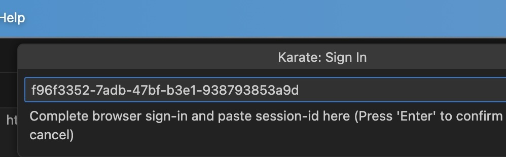

<p>&nbsp;</p>

Once signed-in you can work offline. You can always run the `Sign In / Manage License` command to see how many days are left in your session.

If you need an [offline license](#offline-license) because of strict security or similar restrictions in your environment, please [contact us](https://www.karatelabs.io/contact-us). Please note that this option is available only for enterprise customers of Karate Labs.

## Settings

You can access the extension settings by clicking on the "gear" icon after going to "Extensions" on the nav-bar.

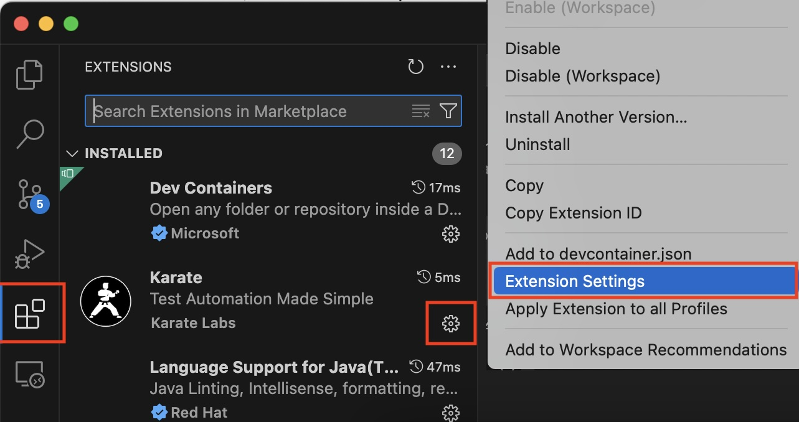

<p>&nbsp;</p>

Especially if you are working with Java Maven or Gradle projects, it is recommended that you have the [Language Support for Java](https://marketplace.visualstudio.com/items?itemName=redhat.java) VS Code extension installed.

Then keep the `karatelabs.karate.run.mode` setting as `vscode-java` (the default).


### Standalone
You can change the `karatelabs.karate.run.mode` setting to `standalone` if you want to use the [Karate standalone JAR](https://github.com/karatelabs/karate/wiki/Get-Started:-Other-Runtime-Options#standalone-jar). Download it and choose a local folder to keep JAR files in. Change the `karatelabs.karate.run.modeJars` setting to point to that folder, and for convenience, all JARs within that folder will be included in the runtime classpath.

Note that the `Mode Jars` setting should be a folder name. Do not include the `.jar` part. Note that the default of `.` will work fine for the common parctice of keeping the Karate JAR in the "root" of your project folder.

The `karatelabs.karate.run.classpathPrefix` setting defaults to `.` which should suffice for picking up `karate-config.js` from the workspace root. You can add more classpath entries (comma-delimited) and even JAR files if you wish. For example `.,src/test/java` would also search in `src/test/java` for `karate-config.js`.

### Custom

You can also opt to run commands such as `java` or `mvn` directly with `karatelabs.karate.run.mode` set to `custom`. In this case `java` or `mvn` is expected to be installed and in the system `PATH`.

For convenience the string `${karateArgs}` will be replaced with command-line arguments generated by the extension when performing actions such as `Run` etc.

## Troubleshooting

If the [Language Support for Java](https://marketplace.visualstudio.com/items?itemName=redhat.java) extension is not installed, you will need a Java runtime installed and [`JAVA_HOME` set in your environment](https://www.baeldung.com/java-home-on-windows-mac-os-x-linux). Having the `java` command in your [system `PATH`](https://www.java.com/en/download/help/path.html) should also be sufficient. Java 11 or higher is needed for Karate 1.4.X and Java 17 is needed for Karate 1.5.0 and above.

There is a `Karate Log` within the "Output" tab (next to "Terminal") typically at the bottom of your VS Code window. You can look at it to find the reasons for failure.

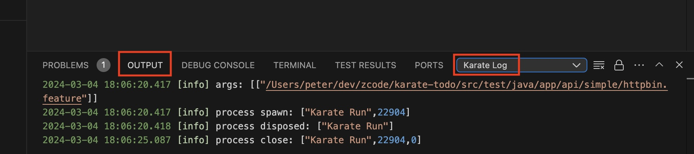

<p>&nbsp;</p>

To change the log level you can use the VS Code Command `Developer: Set Log Level` (`View --> Command Palette` and type "Log") and then select `Karate Log`. Changing the log level to `Debug` gives you more information.

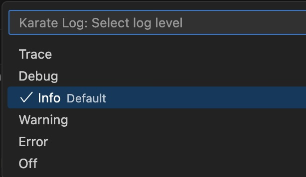

## Run From Editor
You can run a feature file open in the editor by using the CodeLens. The keyboard shortcut `[CTRL]` `[F5]` also works.

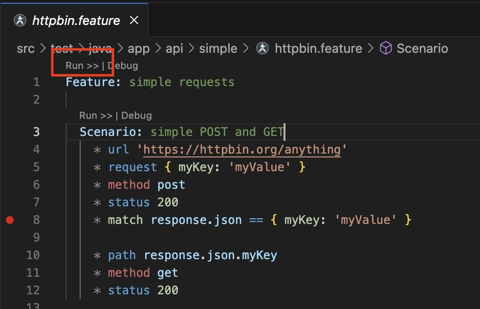

<p>&nbsp;</p>

You can run a single `Scenario` by using the CodeLens that appears above it.

You can even run a single "example" in a `Scenario Outline` by right-clicking on one of the data-rows within an `Examples` table.

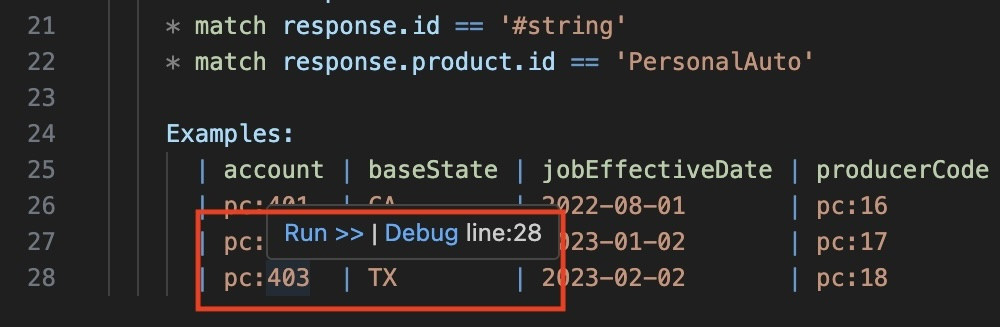

## Launch Configurations
VS Code [launch-configurations](https://code.visualstudio.com/docs/editor/debugging) are useful for being able to re-run tests with specific parameters. All the typical Karate options you need are supported, including control over the JVM parameters and working directory. The feature file (or path to search for feature files) should be the last argument.

Here is an example `.vscode/launch.json` file:

```json
{
    "version": "0.2.0",
    "configurations": [
        {
            "type": "karate",
            "name": "env-test",
            "request": "launch",
            "karateArgs": [
                "-e",
                "test",
                "${file}"
            ]
        }
    ]
}
```

The advantage is that you can set up any combination of [Karate runtime options](https://github.com/karatelabs/karate#karateoptions) via `karateArgs`. For example you can:
* [run tests in parallel](https://github.com/karatelabs/karate/tree/master/karate-netty#parallel-execution)
* [set the environment](https://github.com/karatelabs/karate/tree/master/karate-netty#karateenv)
* or [choose tags](https://github.com/karatelabs/karate/tree/master/karate-netty#tags) to include or exclude.

Now you can run tests from the [Run and Debug](https://code.visualstudio.com/docs/editor/debugging#_launch-configurations) view in VS Code and keyboard short-cuts such as `F5` will work for the currently focused file in the editor. Note that you can even Run without Debugging: `Ctrl + F5`.


<p>&nbsp;</p>

You can have multiple configurations and easily switch between them.

You can add `"noDebug": true` to the run-configuration JSON to force "Run without Debugging" for convenience.

Instead of `${file}` as the value for `feature`, you can use any valid folder path or even multiple feature files.

## Outline View
The VS Code [outline view](https://code.visualstudio.com/docs/getstarted/userinterface#_outline-view) is supported so you can navigate large files with ease.

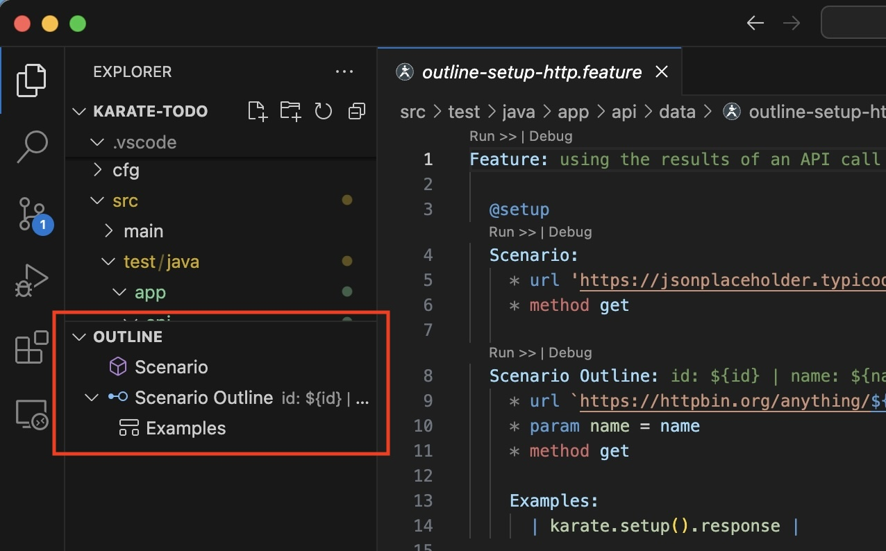

## Code Formatting
VS Code [code-formatting](https://code.visualstudio.com/docs/editor/codebasics#_formatting) shortcuts work to format indenting of feature file elements.

## Test Results
The HTML report is one-click away.

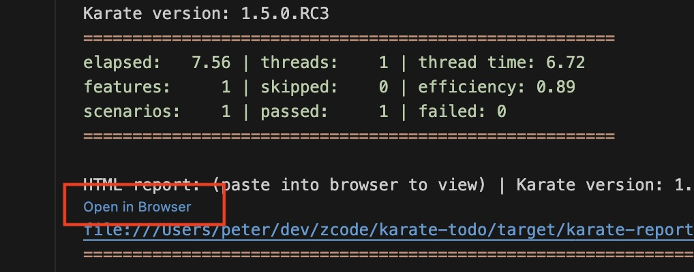

## Auto Complete
Besides the syntax validation, you have auto-complete for the most commonly used keywords.

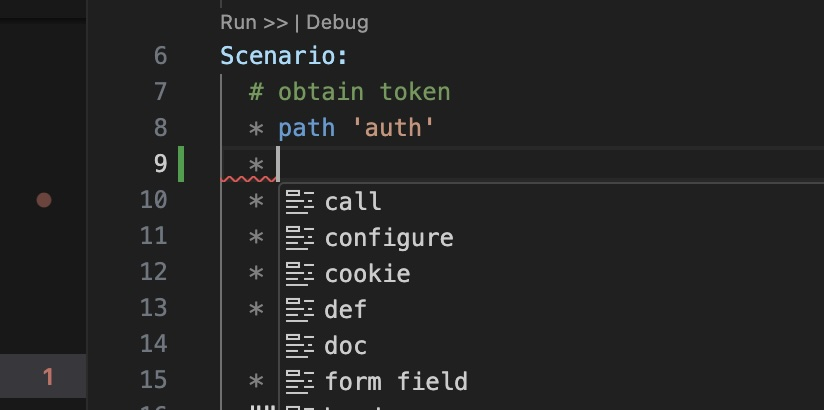

## Code Folding
You can collapse sections to make it easier to deal with long tests.

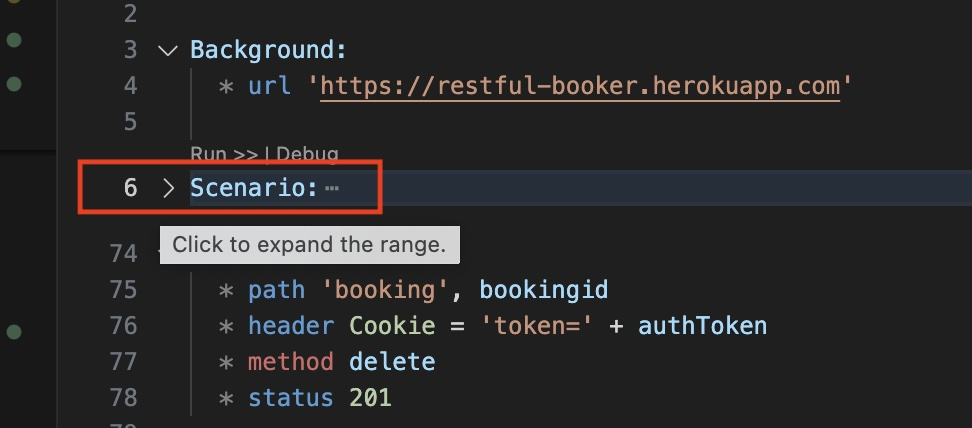

## References
Coming Soon.

## JSON Re-formatting
Place the cursor within JSON to see options to re-format it, you will see a "bulb" icon.

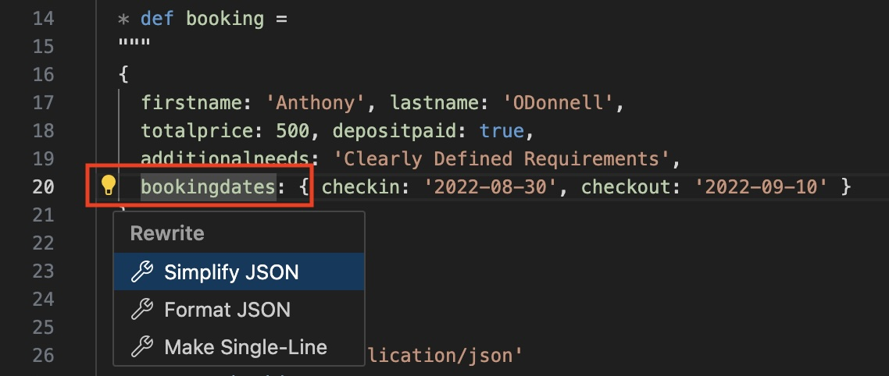

<p>&nbsp;</p>

The following options are possible (depending on context):

* Lenient - just like JS, where single-quotes are used and no quotes are needed for property keys
* Strict - Strict JSON, using double-quotes
* Make single Line - convert multi-line JSON to a single line
* Make multi-line - convert a single line of JSON to multi-line, including triple-quotes

## Run Folder

As a convenience, you can right-click and run a folder from the explorer view.

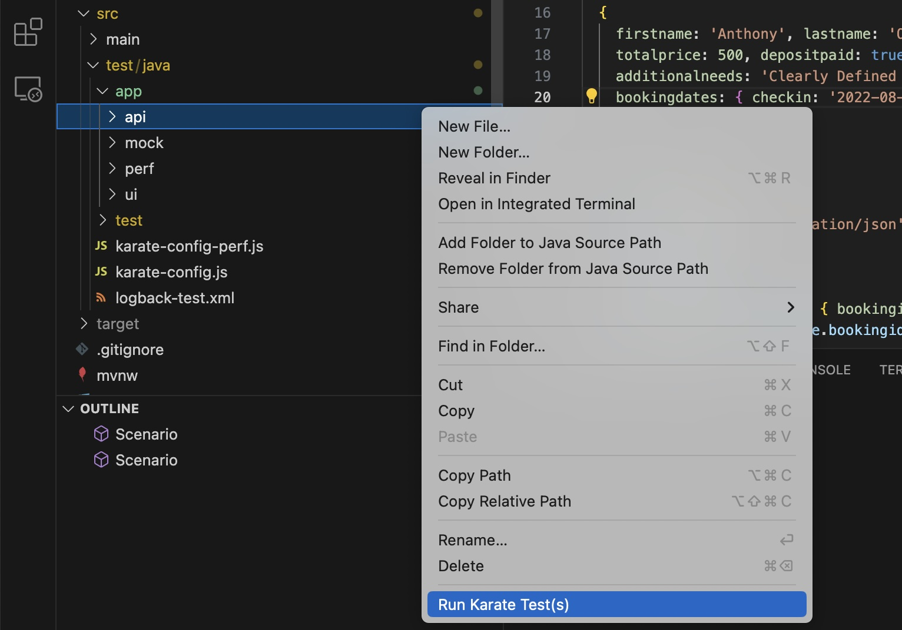

## Debug

You can set break-points on Karate feature files in debug mode. The Karate debugger can even step-back and hot-reload simple edits to your test.

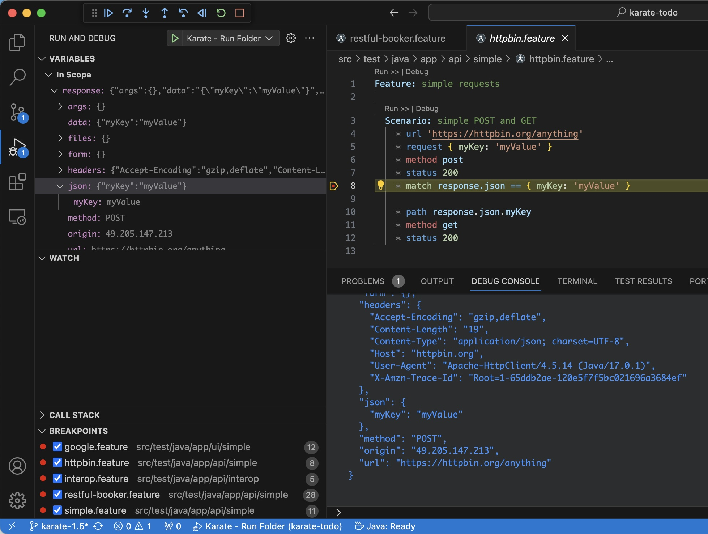

### Debug Java from Karate

A Karate debug session will even stop at Java breakpoints.

### Debug Karate from Java

You can also start a normal Java debug session that uses the Karate `Runner` Java API but still stop at Karate breakpoints. This requires you to be using Karate version 1.5.0.RC3 or greater.

## Offline License

> [!IMPORTANT]  
> The Offline License is a [paid feature for enterprises](https://www.karatelabs.io/pricing). Please make sure you know who your designated admin is before you perform this step.


The dialog you see when you invoke the [`Sign In / Manage License`](#license-activation) command looks like this.

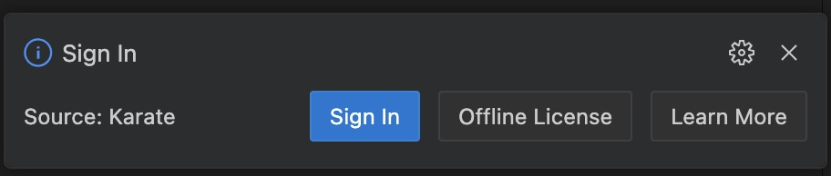

<p>&nbsp;</p>

Click the `Offline License` button. A unique code for your system will be shown which you can cut and paste. In the example below, it is: `DhHOFKHvd7XYTi+rQnNTJQ==`

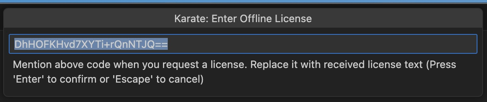

<p>&nbsp;</p>

Send that unique code to your designated admin. You will be issued a license that is tied to this unique code. To apply the license, copy *all* the text from the license file (which should start with: `-----BEGIN LICENSE FILE-----`) and paste it into the text-field shown above. Make sure you *clear* the text-box before pasting the license file text or just replace the initial contents. Now you should see something like this.

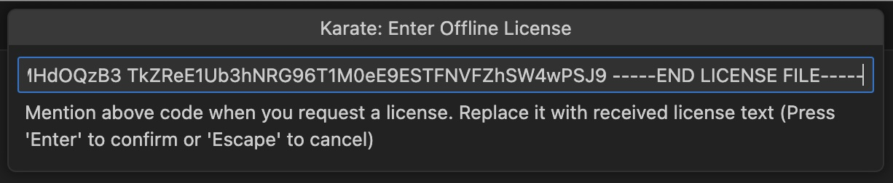

<p>&nbsp;</p>

Click [ENTER] and should see a confirmation message with your license details.


