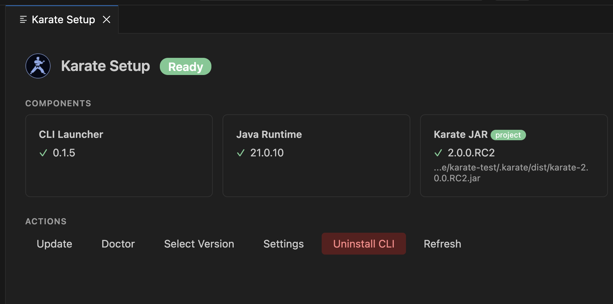
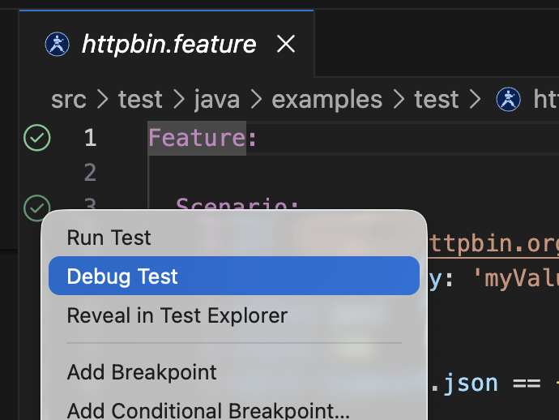
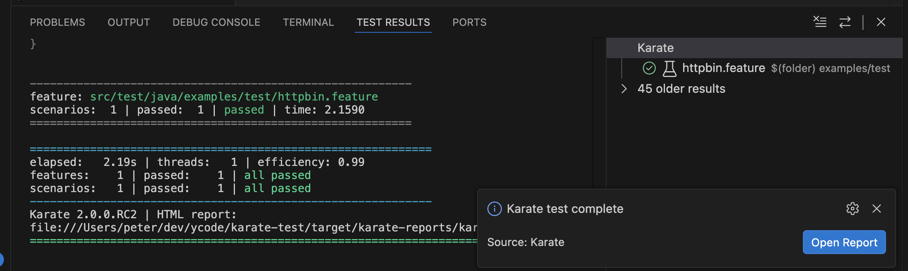
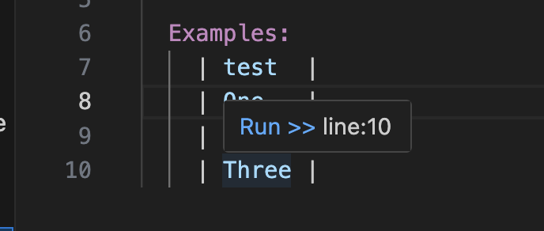
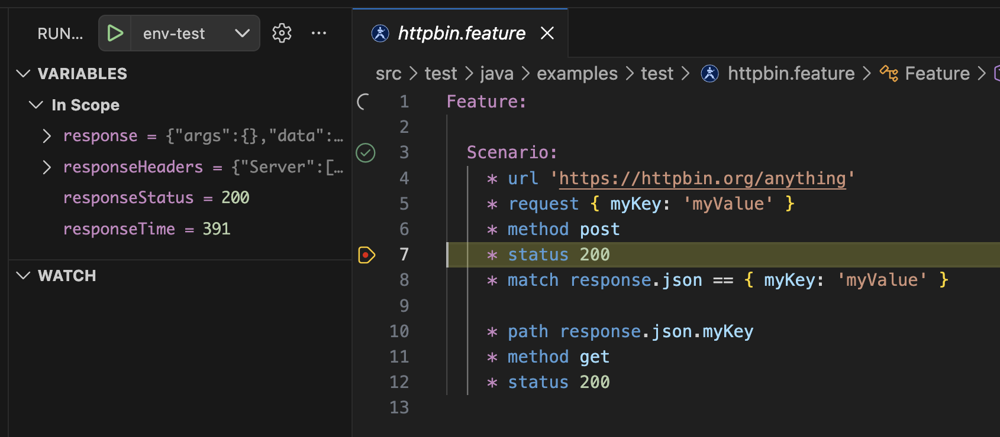
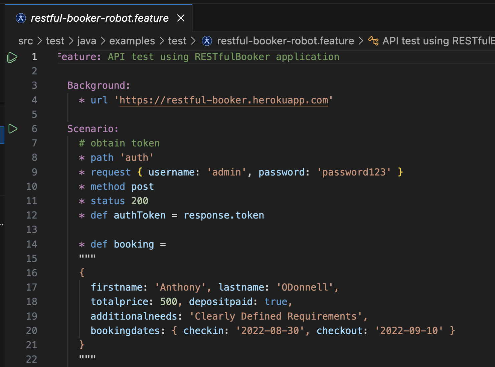
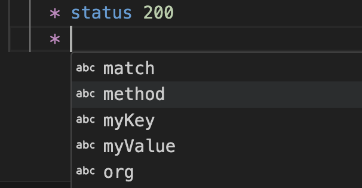
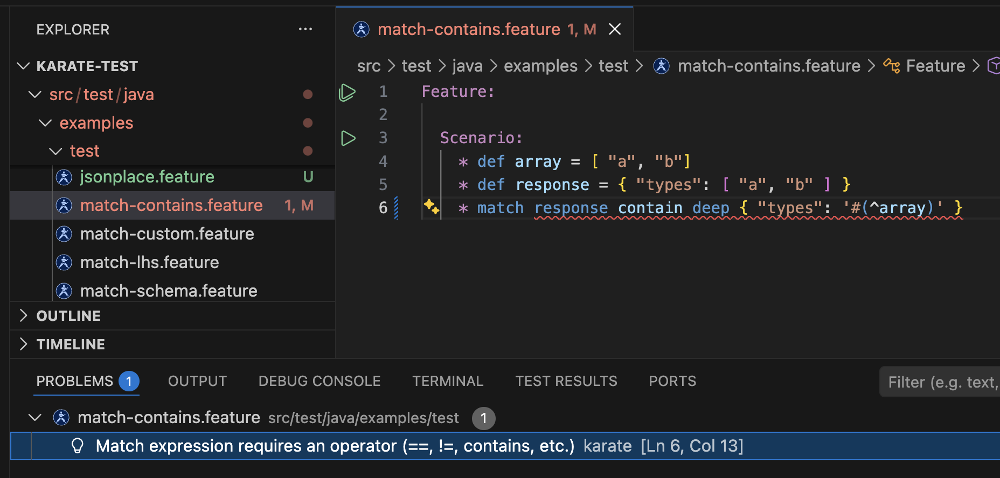
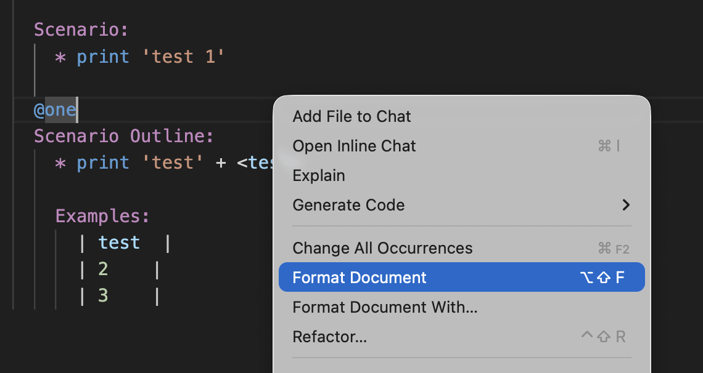
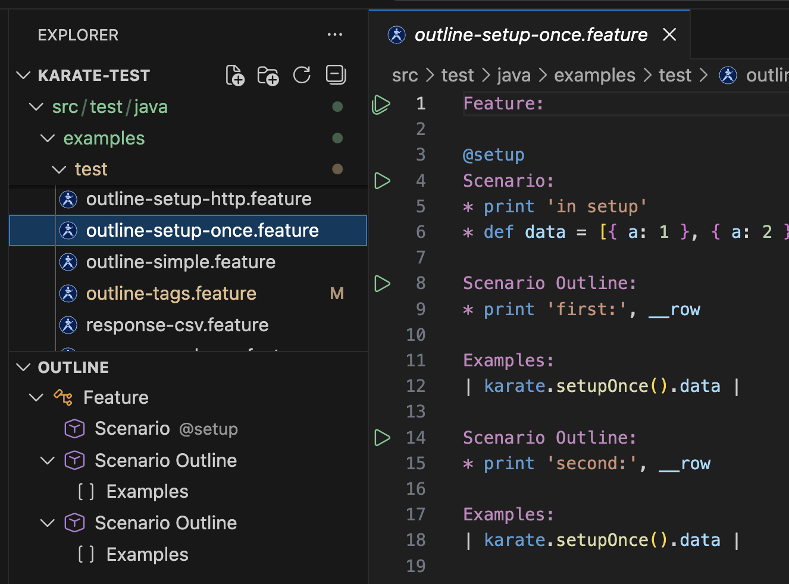

<table>
    <tr>
        <td>
            <br/><a href="https://karatelabs.io"></a>
        </td>
        <td>
            <h2><br/>VS Code<br/>Extension</h2>
        </td>
        <th>
            <h3><a href="https://youtu.be/nXUSnxcdljQ?si=wCh-m1qL5Rj1qQIS">:tv: <br/>&nbsp;Video&nbsp;</a></h3>
        </th>
        <th>
            <h3><a href="https://www.karatelabs.io/pricing">:heavy_dollar_sign: <br/>Pricing</a></h3>
        </th>
        <th>
            <h3><a href="https://marketplace.visualstudio.com/items?itemName=karatelabs.karate"><br/>:zap: <br/> Market<br/>place</a></h3>
        </th>
        <th>
            <h3><a href="https://open-vsx.org/extension/karatelabs/karate"><br/>:bulb: <br/>&nbsp;Open&nbsp;<br/>VSX</a></h3>
        </th>
        <th>
            <h3><a href="https://github.com/karatelabs/vscode-extension/issues">:octocat: <br/>Issues</a></h3>
        </th>
    </tr>
</table>

<table>
    <tr>
        <th>PLUS</th>
        <th>PRO</th>
        <th>Enterprise</th>
    </tr>
    <tr>
        <td>
            <ul>
                <li>Syntax coloring</li>
                <li>Run Feature from editor</li>
                <li><a href="#test-execution">Run single Scenario / Example</a></li>
                <li><a href="#launch-configurations">Launch Configurations</a></li>
                <li><a href="#outline">Outline view</a></li>
                <li><a href="#formatting">Code formatting</a></li>
                <li>Test Results in IDE</li>
            </ul>
        </td>
        <td>
            <i>&nbsp;&nbsp;&nbsp;&nbsp;(includes all in PLUS)</i>
            <ul>
                <li><a href="#code-completion">Auto complete</a></li>
                <li><a href="#code-folding">Code folding</a></li>
                <li><a href="#json-re-formatting">JSON re-formatting</a></li>
                <li>Run all tests in folder</li>
                <li><a href="#debug">Debug Karate test</a></li>
                <li>Debug Java &amp; Karate in same session</li>
                <li>Java debug session stops at Karate breakpoints</li>
                <li><a href="#diagnostics">Match syntax diagnostics</a></li>
            </ul>
        </td>
        <td>
            <ul>
                <li>Priority support</li>
                <li>SSO / SAML support</li>
                <li><a href="#offline-license">Offline license</a></li>
                <li><a href="https://www.karatelabs.io/contact-us">Contact us</a></li>
            </ul>
        </td>
    </tr>
</table>

> By using this plugin, you agree to the Karate Labs [EULA](https://karatelabs.io/eula). Data on a few user actions is collected and subject to our [Privacy Policy](https://karatelabs.io/privacy-policy). HTML reports generated by the Karate open-source library has [additional analytics](https://github.com/karatelabs/karate/blob/master/karate-core/src/test/resources/analytics.md).

## Key Improvements

This extension supports [Karate v2](https://github.com/karatelabs/karate-v2) — the next generation of the Karate test automation framework. Karate v2 brings major improvements that make getting started simpler and test execution more powerful:

- **Simple installation** — the Karate CLI is a single binary, no Maven or Gradle project needed. Install it from within VS Code with one click via the Setup Dashboard.
- **JavaScript debugging** — set breakpoints and step through embedded JavaScript within `.feature` files for the first time
- **ANSI colors in console** — rich colored output in the terminal, works even outside the IDE
- **HTML reports with tag filtering** — interactive reports that let you filter results by tags
- **Soft assertions** — JSON validation works in soft assertion mode by default, so tests continue and report all failures instead of stopping at the first one
- **Large JSON support** — operations such as `contains` use disk when needed to avoid out-of-memory issues on large payloads
- **Setup UI** — see status of Karate / CLI installation or troubleshoot
- **One-click license renew** — refresh your session instantly without going through the full sign-in flow again
- **VS Code native test runner** — view tests in dedicated test tree view, smaller gutter icons, right-click to debug
- **Better Formatter** — Karate syntax coloring and inline JS and Examples tables parsing re-written from scratch
- **Match Syntax Diagnostics** — syntax errors in Karate feature files highlighted and appears in "Problems" tab

## Getting Started

### Quick Start (karate-cli)

1. Install this extension from the [VS Code Marketplace](https://marketplace.visualstudio.com/items?itemName=karatelabs.karate)
2. Open Command Palette > **Karate: Setup** to install the CLI
3. Open a `.feature` file — play buttons appear in the gutter
4. Press **Cmd+F5** (macOS) or **Ctrl+F5** (Windows/Linux) to run



### Maven / Gradle (vscode-java)

1. Install [Language Support for Java](https://marketplace.visualstudio.com/items?itemName=redhat.java)
2. Set run mode to `vscode-java` in settings, or leave on `auto` (auto-detects `pom.xml` / `build.gradle`)
3. Open a `.feature` file and run from the gutter or Test Explorer

## Migrating from the Previous Version

If you are upgrading from the previous version of this extension (v2.x), here is what you need to know. If you are also upgrading from Karate v1 to Karate v2, see the [Karate v2 Migration Guide](https://github.com/karatelabs/karate/blob/main/docs/MIGRATION_GUIDE.md) for framework-level changes.

> Looking for the v2.x extension documentation? See the [previous version README](https://github.com/karatelabs/vscode-extension/blob/v2.0.6/README.md).

### What's Changed

- **Run mode default**: The default run mode is now `auto` instead of `vscode-java`. Auto mode detects your project type — if you have `pom.xml` or `build.gradle`, it uses vscode-java automatically. You can also set it explicitly in settings.
- **CodeLens replaced by gutter icons**: The `Run` / `Debug` text that appeared above scenarios has been replaced by VS Code's native test gutter icons (play buttons in the left margin). These are less obtrusive and support run profiles.
- **Streamlined output**: The dedicated "Karate" output channel has been replaced by the VS Code Test Results panel — faster, less overhead, and integrated with the Test Explorer. Karate v2 provides native ANSI color output, so you get rich colored results without any extra processing by the extension. If you relied on log coloring in v1, upgrading to Karate v2 gives you better colors natively.
- **Standalone mode removed**: Use `karate-cli` mode instead. Install the Karate CLI via **Karate: Setup** — it is a single binary with no dependencies.
- **Custom mode removed**: Use VS Code [launch configurations](#launch-configurations) for custom command setups.

### Why Upgrade to Karate v2

Beyond the extension improvements, Karate v2 itself brings significant benefits:

- **Native ANSI colors** — rich colored console output works everywhere, no extension workarounds needed
- **JavaScript debugging** — step through embedded JS in feature files for the first time
- **Soft assertions** — all match failures reported instead of stopping at the first one
- **Single binary CLI** — no Maven or Gradle needed to get started
- See the full list of framework changes in the [Karate v2 Migration Guide](https://github.com/karatelabs/karate/blob/main/docs/MIGRATION_GUIDE.md)

### Settings Migration

All settings remain under the `karatelabs.karate.*` namespace. Your existing settings will continue to work:

| Old Setting | Status |
|---|---|
| `karatelabs.karate.run.mode` | Still supported — now also accepts `auto` |
| `karatelabs.karate.run.modeJars` | Removed (standalone mode deprecated) |
| `karatelabs.karate.run.classpathPrefix` | Removed (standalone mode deprecated) |
| `karatelabs.karate.karateCommand` | Still supported |
| `karatelabs.karate.cliOptions` | Still supported |

### License Compatibility

Your existing license file (`~/.karate/karate.lic`) is fully compatible. Offline licenses continue to work without changes. If you were previously signed in, you may need to sign in again via **Karate: Sign In / Manage License**.

## Run Modes

| Mode | For | How |
|------|-----|-----|
| **auto** (default) | Any project | Detects project type automatically |
| **karate-cli** | v2 + `karate-pom.json` | Spawns CLI directly |
| **vscode-java** | Maven / Gradle | Uses Red Hat Java extension |

## Test Execution



Run tests from:
- **Gutter play buttons** — click the green triangle next to any Scenario
- **Keyboard shortcut** — Cmd+F5 / Ctrl+F5 runs the test at cursor
- **Test Explorer** — tree view in the sidebar with run/debug buttons
- **Explorer context menu** — right-click a `.feature` file to run
- **Example row hover** — hover over an Examples data row to see `[Run >>]`





### Launch Configurations

VS Code [launch configurations](https://code.visualstudio.com/docs/editor/debugging) are useful for re-running tests with specific parameters. All the typical Karate options are supported, including control over JVM parameters and working directory.

Example `.vscode/launch.json`:

```json
{
    "version": "0.2.0",
    "configurations": [
        {
            "type": "karate",
            "name": "env-test",
            "request": "launch",
            "karateArgs": [
                "-e",
                "test",
                "${file}"
            ]
        }
    ]
}
```

You can set up any combination of [Karate runtime options](https://github.com/karatelabs/karate#karateoptions) via `karateArgs`. For example you can:
* [run tests in parallel](https://github.com/karatelabs/karate/tree/master/karate-netty#parallel-execution)
* [set the environment](https://github.com/karatelabs/karate/tree/master/karate-netty#karateenv)
* or [choose tags](https://github.com/karatelabs/karate/tree/master/karate-netty#tags) to include or exclude

You can have multiple configurations and easily switch between them from the [Run and Debug](https://code.visualstudio.com/docs/editor/debugging#_launch-configurations) view. Add `"noDebug": true` to force "Run without Debugging" for convenience.

## Debug



Set breakpoints in `.feature` files and debug with the Test Explorer debug profile. Works in both karate-cli and vscode-java modes. With Karate v2, you can also debug embedded JavaScript — step through JS expressions, inspect variables, and set breakpoints in inline scripts.

### Debug Java from Karate

A Karate debug session will stop at Java breakpoints, allowing you to debug both Karate and Java code in the same session.

### Debug Karate from Java

You can start a normal Java debug session that uses the Karate `Runner` Java API and still stop at Karate breakpoints. This requires the [Language Support for Java](https://marketplace.visualstudio.com/items?itemName=redhat.java) extension and `vscode-java` run mode.

## Language Features

### Syntax Highlighting



Rich syntax coloring for Karate/Gherkin with embedded JavaScript support.

### Code Completion



Auto-complete Karate keywords after step prefixes (`Given`, `When`, `Then`, `And`, `*`).

### Diagnostics



Real-time syntax error highlighting for Gherkin structure, match expressions, and embedded JavaScript.

### Formatting



Format document aligns Examples table columns and normalizes indentation. Use the VS Code [code-formatting](https://code.visualstudio.com/docs/editor/codebasics#_formatting) keyboard shortcut to format the current file.

### Outline



Feature / Scenario / Scenario Outline tree in the [Outline view](https://code.visualstudio.com/docs/getstarted/userinterface#_outline-view) sidebar. Navigate large files with ease.

### Code Folding

Collapse sections to make it easier to deal with long feature files. Multi-line regions including Scenario blocks, Background, and doc-strings can be folded.

### JSON Re-formatting

Place the cursor within JSON embedded in a feature file to see code-action options (light-bulb icon):

* **Simplify** — Karate's lenient format, where single-quotes are used and no quotes are needed for property keys
* **Strict** — strict JSON using double-quotes
* **Make single line** — convert multi-line JSON to a single line
* **Make multi-line** — convert a single line of JSON to multi-line, including triple-quotes

## License Activation

License activation and status is available via a command. Go to `View -> Command Palette`, type `Karate` and choose **Sign In / Manage License**.

| Tier | Features |
|------|----------|
| **PLUS** | Run tests, syntax coloring, outline, formatting |
| **PRO** | Debug, code completion, code folding, diagnostics, JSON re-formatting |

Click `Sign In` to be taken through the sign-in flow linked to your existing subscription. Once you have authenticated, copy the session ID from the browser and paste it into the input box in VS Code.

**One-click renew** — if your subscription is still valid, click **Renew** from the license info dialog to refresh your session instantly. No need to go through the full sign-in flow again.

Once signed in you can work offline. Run the **Sign In / Manage License** command at any time to see how many days are left in your session.

### Offline License

> [!IMPORTANT]
> The Offline License is a [paid feature for enterprises](https://www.karatelabs.io/pricing). Please make sure you know who your designated admin is before you perform this step.

If you need an offline license because of strict security or similar restrictions in your environment, please [contact us](https://www.karatelabs.io/contact-us).

When you invoke the **Sign In / Manage License** command, click the `Offline License` button. A unique code for your system will be shown which you can copy and send to your designated admin. You will be issued a license tied to this unique code. To apply the license, paste the full license text (starting with `-----BEGIN LICENSE FILE-----`) into the text field.

## Extension Settings

| Setting | Default | Description |
|---------|---------|-------------|
| `karatelabs.karate.run.mode` | `auto` | How to run tests: `auto`, `karate-cli`, or `vscode-java` |
| `karatelabs.karate.run.console` | `integratedTerminal` | Where to show test output |
| `karatelabs.karate.karateCommand` | `karate` | Path to the Karate CLI executable |
| `karatelabs.karate.cliOptions` | `[]` | Additional CLI options passed to the Karate CLI |

> **Tip**: VS Code supports [workspace settings](https://code.visualstudio.com/docs/getstarted/settings#_workspace-settings) in `.vscode/settings.json` that can be shared via version control to ensure your whole team uses the same configuration.

## Commands

| Command | Description |
|---------|-------------|
| **Karate: Setup** | Open the Setup Dashboard |
| **Karate: Sign In / Manage License** | Sign in or manage your license |
| **Karate: Kill All Running Tests** | Stop all running Karate processes |
| **Karate: Clean Reports** | Clean karate report files |
| **Karate: New Feature File** | Create a new `.feature` file from a template |

## Keyboard Shortcuts

| Shortcut | Action |
|----------|--------|
| Cmd+F5 / Ctrl+F5 | Run test at cursor |

## Troubleshooting

- **CLI not found**: Run **Karate: Setup** to install the CLI, or set `karatelabs.karate.karateCommand` to the full path
- **vscode-java not working**: Ensure the [Language Support for Java](https://marketplace.visualstudio.com/items?itemName=redhat.java) extension is installed and the project has imported successfully (look for the "Java Ready" indicator in the status bar)
- **Debug not starting**: Check the Karate Debug output channel for errors
- **Check logs**: Open the Output panel and select "Karate" for extension logs. Use the VS Code command `Developer: Set Log Level` to change the log level to `Debug` for more detail.
- **Feature file not recognized**: If another extension is handling `*.feature` files, make sure the Karate Labs extension is set as the default. Check that the language mode in the status bar shows "Karate" and not "Cucumber" or similar.

## Links

- [Karate Documentation](https://karatelabs.github.io/karate/)
- [Pricing](https://www.karatelabs.io/pricing)
- [Report Issues](https://github.com/karatelabs/vscode-extension/issues)
- [EULA](https://www.karatelabs.io/eula)
- [Privacy Policy](https://www.karatelabs.io/privacy-policy)
- [Previous version (v2.x) documentation](https://github.com/karatelabs/vscode-extension/blob/v2.0.6/README.md)
