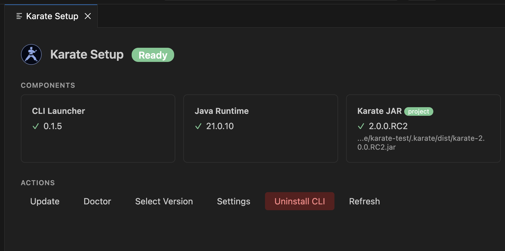

# Karate VS Code Extension

## API, Performance, and UI testing — natively in VS Code

Write, run, and debug Karate tests with native Test Explorer integration, gutter run buttons, and breakpoint debugging — including embedded JavaScript.

---

  

---

### [:globe_with_meridians: **Visit the Documentation Site**](https://docs.karatelabs.io/ide-support/vs-code)

**Everything you need is here:**
Installation • Quick Start • Features • License Activation

---

[:zap: VS Code Marketplace](https://marketplace.visualstudio.com/items?itemName=karatelabs.karate) •
[:bulb: Open VSX](https://open-vsx.org/extension/karatelabs/karate) •
[:heavy_dollar_sign: Pricing](https://www.karatelabs.io/pricing) •
[:octocat: Report Issues](https://github.com/karatelabs/vscode-extension/issues)

